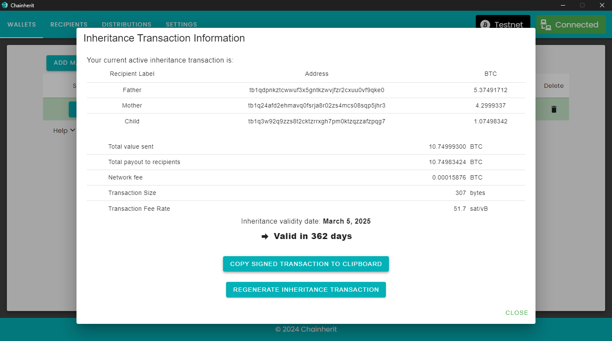

#  Chainherit

Chainherit allows Bitcoin wallet owners to securely and trustlessly set up an inheritance mechanism for their digital wealth. This beta software uses Bitcoin's `nLockTime` feature to create transactions that only become valid after a specified date, ensuring your assets are passed on precisely as intended.

## How It Works

Chainherit uses the `nLockTime` field in Bitcoin transactions to create a presigned transaction that becomes valid only after a certain time. This allows the wallet owner to sign a transaction that the inheritor can broadcast only after the specified date, ensuring assets can only be transferred when intended.

## Important Considerations

Before distributing an inheritance transaction, be mindful of the privacy implications, as it reveals the distribution of your assets. If an inheritance transaction is shared prematurely, it must be invalidated before its validity date. This can be achieved by conducting a transaction with all/most of your balance from your wallet back into the same wallet (send-to-self), thus invalidating the inheritance transaction.

## Features

- **Secure Inheritance Setup:** Enables setting up inheritance without losing control over your assets or having complicated tapscript/multisig setups.
- **Wallet Compatibility:** Works with P2PKH, P2SH-P2WPKH and P2WPKH Bitcoin wallets. Reach out if you need support for other wallet types.
- **Wallet Security:** The transaction signing process is managed by the user through an external wallet. We generally recommend to use Electrum. Chainherit only requires the wallet's Master Public Key to derive addresses and check balances, therefore Chainherit has no access to your funds at any time.

## Getting Started

[Watch the video tutorial](https://youtu.be/zU-290z2c08) to get started with Chainherit.

### Prerequisites (You will need)

- **Electrum Wallet:** Recommended for its reliability and trust. Your wallet's Master Public Key is needed, accessible via `Wallet` -> `Information`.
- **Inheritor(s) Bitcoin Address(es):** To define who will receive your assets.
- **Encryption Password:** For securing the local database that stores your wallet balance information and inheritance configurations.

### Installation and Setup

1. **Launch Chainherit:** Start by setting a strong password for encrypting your data.
2. **Add Recipients:** Input Bitcoin addresses for your inheritors with label names.
3. **Create Distribution:** Allocate how your Bitcoin will be divided among your inheritors.
4. **Generate Unsigned Transaction:** Choose a validity date and distribution setup for the inheritance transaction.
5. **Electrum Signing:** Import, verify, and sign the transaction in Electrum.
6. **Finalize in Chainherit:** Import the signed transaction back to create a inheritance PDF and store it encrypted in the local Chainherit database.

## Screenshot



## Dev commands

Setup environment
```cp .env.example .env```

Generate prisma DB client
```npx prisma generate```

Generate prisma migration
```npx prisma migrate dev --name init```


## Contribution and Feedback

If you want to discuss Chainherit, feel free to [join the Discord server](https://discord.gg/9hv2d3ak87) and ask any questions you may have. I am happy to help and discuss any ideas or issues you may have.

Contributions are welcome via issues and pull requests on GitHub. Your feedback helps improve Chainherit.

If you find any bugs or have any suggestions, please open an issue on the GitHub repository.

Feel free to fork the repository and submit a pull request. I am happy to review and merge any contributions.
I am open to any suggestions and improvements to the process and the software.

## Disclaimer

The developer is not liable for any loss or damages resulting from Chainherit's use. It is provided as-is, with no guarantees.
It is the user's responsibility to ensure the security of their Bitcoin wallet and inheritance transactions.

## Support Development

Donations are appreciated and help continue development and improvements.

**Bitcoin Donation Address:** `bc1q9ghp9upvwlacz25sap2nwq5g8sw3x7pnemxst5`

## License

Chainherit is licensed under the MIT License. The full license can be found in the LICENSE file in the root directory of the repository.
